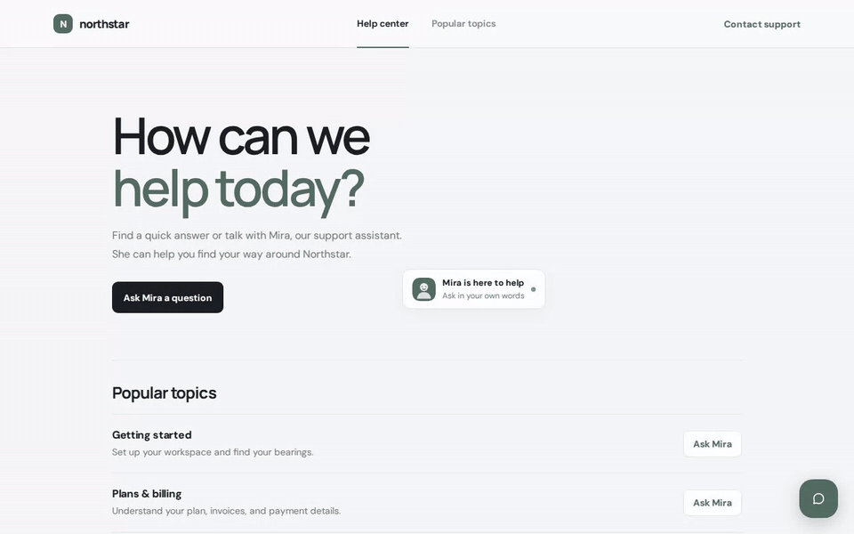
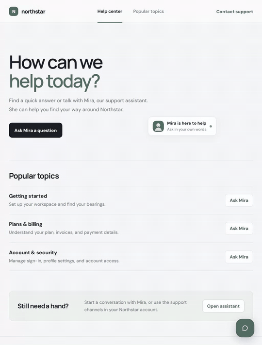
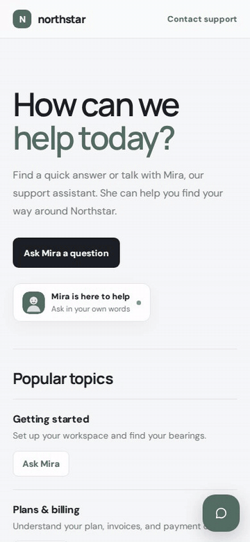
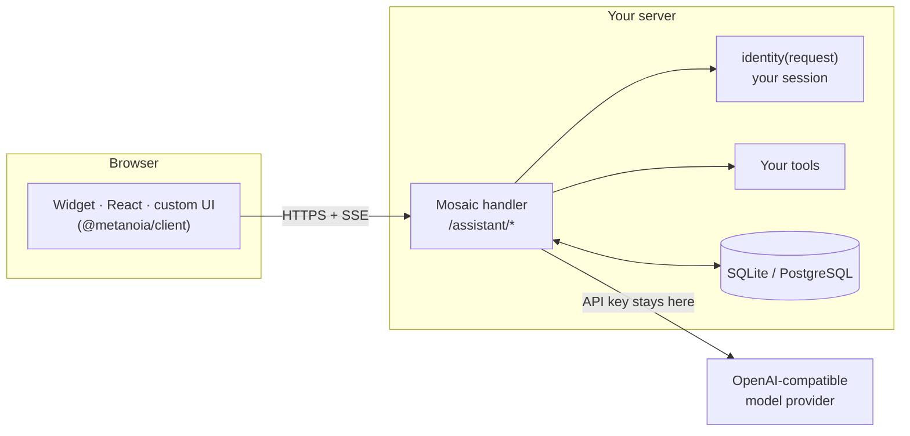

<div align="center">

# Metanoia Mosaic

**A self-hosted AI assistant you drop into any app.**<br>
Bring any OpenAI-compatible model. Keep identity, memory, tools, and data on your own server.

[Quick start](#quick-start) · [Add it to your app](#add-it-to-your-app) · [Features](#features) · [Providers](#providers) · [Docs](#documentation)

<br>



</div>

## The same assistant on every screen

The widget is one Shadow DOM component. It floats beside your page on large screens and becomes a near-full-screen sheet on phones, with the same features in both.

<table>
  <tr>
    <td align="center" valign="top" width="58%">
      <br>
      <sub><b>Tablet · 820px.</b> Opened from an in-page link. Markdown answers, follow-up suggestions.</sub>
    </td>
    <td align="center" valign="top" width="42%">
      <br>
      <sub><b>Phone · 390px.</b> Launcher, streaming reply, saved history.</sub>
    </td>
  </tr>
</table>

<sub>Recorded against a live model (Llama 3.1 8B on DeepInfra) running the bundled [Northstar example](examples/express). Nothing in the recordings is mocked.</sub>

## Why Mosaic

Most chat widgets send your users' conversations to someone else's backend. Mosaic runs on your server instead:

- **Your users, verified by your app.** A resolver you write maps the request's session to a user. The browser never chooses who it is.
- **Your data, in your database.** Conversations, memories, preferences, and images live in SQLite or PostgreSQL that you control.
- **Your model.** Point it at OpenAI, OpenRouter, DeepInfra, or any OpenAI-compatible endpoint. Keys never reach the browser.
- **Your functions.** Register server-side tools ("look up this order") that run with the signed-in user's identity.

## Quick start

Requires Node.js 20 or newer.

```sh
git clone https://github.com/Xephyr-Labs/metanoia-mosaic.git
cd metanoia-mosaic
npm ci && npm run build
```

**Try it without an API key.** Mock mode runs the real widget, HTTP API, streaming, and storage, with clearly labeled synthetic replies:

```sh
CHATBOT_DEMO_MODE=true npm run start --workspace @metanoia/example-express
# open http://localhost:3000
```

**Try it with a real model.** Copy `examples/express/.env.example` to `examples/express/.env`, then set any OpenAI-compatible provider:

```sh
OPENAI_BASE_URL=https://api.deepinfra.com/v1/openai
OPENAI_API_KEY=your-key
OPENAI_MODEL=meta-llama/Meta-Llama-3.1-8B-Instruct-Turbo
OPENAI_COMPATIBILITY=deepinfra
```

```sh
npm run dev --workspace @metanoia/example-express
```

> The example uses anonymous browser sessions for local testing only. Don't expose it to the internet. Your app should supply a real `identity` resolver, as shown below.

## Add it to your app

### 1. Mount the backend

```js
import express from "express";
import { createChatbot, expressHandler } from "@metanoia/chatbot";

const chatbot = createChatbot({
  provider: {
    baseUrl: process.env.AI_BASE_URL,
    apiKey: process.env.AI_API_KEY,
    model: process.env.AI_MODEL,
    compatibility: "openai", // or "openrouter" | "deepinfra"
  },
  // Resolve the user from YOUR session. Never trust a user ID sent by the browser.
  identity: async request => {
    const user = await getSessionUser(request);
    return user ? { userId: user.id, profile: { name: user.name, plan: user.plan } } : null;
  },
  storage: { type: "sqlite", filename: "./data/chatbot.sqlite" },
  branding: { name: "Mira", greeting: "How can I help?", personality: "Be warm and concise." },
  capabilities: { suggestions: { enabled: true, count: 3 } },
});

await chatbot.ready;
const app = express();
app.use("/assistant", expressHandler(chatbot));
app.listen(3000);
```

For Next.js, Hono, Fastify, or any server that speaks Web `Request`/`Response`, use `createChatbotFetchHandler(chatbot, { basePath })`. See the [framework recipes](docs/frameworks/).

### 2. Add the interface

Pick whichever fits your frontend:

<table>
<tr><th>Plain HTML</th><th>React</th></tr>
<tr><td>

```html
<script src="https://cdn.jsdelivr.net/npm/@metanoia/widget@0/dist/loader.js" defer></script>
<metanoia-chat
  endpoint="/assistant"
  name="Mira"
  theme="system">
</metanoia-chat>
```

</td><td>

```jsx
import { OmniChatbot } from "@metanoia/react";

export function Assistant() {
  return <OmniChatbot endpoint="/assistant"
    name="Mira" theme="system" />;
}
```

</td></tr>
<tr><th>Any bundler</th><th>Your own UI or a mobile app</th></tr>
<tr><td>

```js
import { mount } from "@metanoia/widget";

const host = document.body.appendChild(document.createElement("div"));
const assistant = mount(host, {
  endpoint: "/assistant",
  colors: { accent: "#2f5d62" },
});
assistant.open();
```

</td><td>

```js
import { createChatbotClient } from "@metanoia/client";

const bot = createChatbotClient({ endpoint });
const { conversation } = await bot.createConversation();
for await (const e of bot.sendMessage(conversation.id, { content: "Hi" }))
  if (e.type === "delta") render(e.data.text);
```

</td></tr>
</table>

### 3. Give it your app's abilities (optional)

```js
createChatbot({
  // ...
  tools: [{
    name: "lookup_order",
    displayName: "Order lookup",
    description: "Look up the signed-in user's order status by order number.",
    parameters: {
      type: "object",
      properties: { orderNumber: { type: "string" } },
      required: ["orderNumber"],
      additionalProperties: false,
    },
    execute: async ({ orderNumber }, { identity, signal }) =>
      orders.statusFor(identity.userId, orderNumber, { signal }),
  }],
});
```

The model calls the tool, Mosaic validates the arguments against your schema, runs it with a timeout and the user's identity, and streams the answer. The widget shows "Order lookup…" while it runs.

## Features

| | |
| --- | --- |
| **Streaming chat** | Server-Sent Events with live Markdown rendering (lists, bold, code, links), built from DOM nodes and never parsed as HTML. Cancel mid-reply at any time. |
| **Suggested follow-ups** | Optional suggestions after each answer. They're saved with the message and come back when history is reopened. |
| **Memory and context** | Profile data from your app, user preferences, automatically extracted memories, and rolling conversation summaries, all kept within a token budget you configure. |
| **Tools and web search** | Server-side function calling with schema validation and timeouts. Optional OpenRouter web search with clickable citations. |
| **Images and voice** | Image input with server-side format and size checks. Voice input through transcription, and spoken replies. Each one can be turned on separately. |
| **History** | Conversations persist per user. History, new chat, and resume after reload (`conversationStore`). |
| **Brandable UI** | Name, avatar, greeting, starter prompts, colors, font, light/dark/system theme, placement, size, bubble or button launcher. |
| **International** | Every label can be translated. Automatic right-to-left layout for Arabic, Hebrew, Persian, Urdu, and more. |
| **Accessible** | Keyboard operable (Enter sends, Shift+Enter adds a line, Escape closes), visible focus rings, live status announcements, reduced-motion support. |
| **Privacy controls** | One call deletes all of a user's data. Users can view, edit, and remove their own memories. Sensitive facts are filtered from auto-memory. |

## Providers

Any endpoint that implements OpenAI's `/chat/completions` works. Set `compatibility` so Mosaic only sends request fields that provider supports.

| Provider | `compatibility` | Notes |
| --- | --- | --- |
| OpenAI | `"openai"` | Uses `max_completion_tokens`, so reasoning models (gpt-5, o-series) work. Optional `promptCacheKey`. |
| OpenRouter | `"openrouter"` | Session-sticky routing, hosted web search with citations. |
| DeepInfra | `"deepinfra"` | Open-weight models such as Llama, Qwen, and Mistral at low cost. |
| Other compatible APIs | *(omit)* | vLLM, Ollama, LM Studio, LiteLLM, and similar. |

Voice uses its own OpenAI-compatible `audio/transcriptions` and `audio/speech` endpoints, configured separately from chat. Details are in [providers and media](docs/providers-and-media.md).

## How it works



Each request is tied to the user your resolver returns. Conversations, media, and memories are stored per user and per instance, so one server can host several differently branded assistants.

## Secure defaults

- Only same-origin browser requests are accepted until you set `allowedOrigins`. Cross-site writes without an `Origin` header are rejected.
- Request bodies are size-capped before parsing. Images are checked by their magic bytes and dimensions, not just their declared type.
- Context from history, memories, and tool results is labeled as untrusted data in the prompt, never as instructions.
- One reply at a time per conversation, duplicate-submit protection through `requestId`, and optional per-user `rateLimit`.
- Provider errors are reduced to generic messages before they reach the client. Keys and upstream details stay on the server.

## Packages

| Package | What it is |
| --- | --- |
| [`@metanoia/chatbot`](packages/core) | Node.js backend: streaming, tools, memory, storage, Express and Fetch adapters |
| [`@metanoia/widget`](packages/widget) | Framework-free Shadow DOM widget plus the `<metanoia-chat>` custom element |
| [`@metanoia/react`](packages/react) | React wrapper around the widget |
| [`@metanoia/client`](packages/client) | Typed headless client for custom web, React Native, and Expo interfaces |
| [`create-metanoia-mosaic`](packages/create-metanoia-mosaic) | Generates an Express starter project |

The packages haven't had their first npm release yet. Until then, use this workspace and the [local setup](docs/setup.md#get-the-workspace). After release, `npm create metanoia-mosaic` will scaffold a starter.

## Documentation

- [Setup and integration](docs/setup.md): full server and widget walkthrough
- [Framework recipes](docs/frameworks/): Next.js, Hono, Fastify
- [Widget customization](docs/customization.md): branding, labels, persistence
- [Providers, images, and voice](docs/providers-and-media.md)
- [Personalization and privacy](docs/personalization-and-privacy.md)
- [API and host integration](docs/integration.md): routes, SSE events, storage
- [React Native / Expo starter](examples/react-native/README.md)
- [Runnable Express example](examples/express/README.md)

## Development

```sh
npm ci
npm run build      # build every package
npm run typecheck
npm test           # unit, integration, and widget tests (no network)
```

Releases are managed with [Changesets](https://github.com/changesets/changesets): run `npm run changeset` to describe a change.

## License

[MIT](LICENSE) · © 2026 Xephyr Labs
